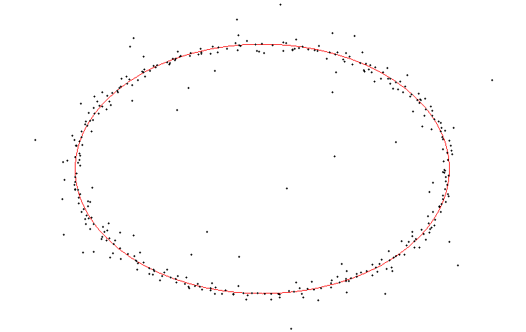

Ellipse emulator
================

Small Qt application with generates image with ellipse and random dots about it.

Image generation
================

1. Paint ellipse inside window.
2. Do grid with starting grid size `(width, height)`.
3. For each cell paint dot if there is ellupse line in this cell.
4. Decrease grid size in two times for width and height.
5. Go to 3 until grid size more than minimal grid size.

Build
=====

```
qmake ellipseemulator.pro
make
```

Example image
=============


